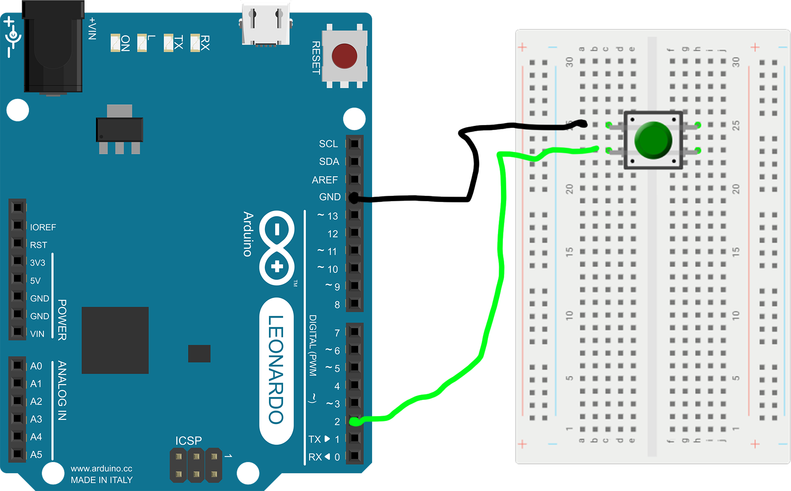

# discord-muter
This is a discord muter that uses an arduino leonardo's HID to press Control Shift M to mute discord.
The device emulates a USB keyboard and sends Discord's default toggle mute shortcut (Ctrl + Shift + M on Windows/Linux, Cmd + Shift + M on macOS). It works globally, even if Discord is in the background.

This project is released under the **MIT License** – feel free to use, modify, and share!

Inspired by similar open-source projects like:

- [mewt](https://github.com/dakota-mewt/mewt?referrer=grok.com) (system-level mute with status LED)
- [footswitch](https://github.com/micolous/footswitch?referrer=grok.com) (push-to-talk foot pedal)

## Features

- Single button press to toggle mute/unmute
- Simple circuit – no soldering required for prototyping (breadboard friendly)
- Compatible with Arduino Leonardo, Pro Micro, or any ATmega32U4-based board
- Easy to extend: add LEDs, multiple buttons (e.g., for deafen), or use as a foot pedal
- No extra software needed – pure HID keyboard emulation

## Materials

- Arduino Leonardo (or Pro Micro/Clones)
- Momentary push button (tactile switch)
- Jumper wires
- Breadboard (for prototyping) or perfboard (for permanent build)

## Wiring

## Code

[code](./discord-mutter.ino)

## Setup Instructions

1. Install [Arduino IDE](https://www.arduino.cc/en/software?referrer=grok.com)
2. Connect your Leonardo via USB
3. Select **Tools > Board > Arduino Leonardo**
4. Copy the code above into a new sketch
5. Upload!
6. Open Discord, join a voice channel, and test the button

The device will appear as a generic keyboard – no drivers needed.
